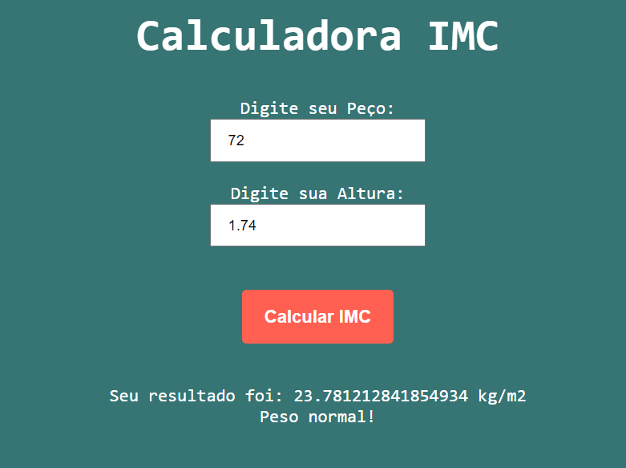

<h1 align="center"> Calculadora IMC </h1>

Programa desenvolvido durante os estudos do curso Fabrica de Aplicativos - Sujeito Programador. 

  <a href="#-tecnologias">Tecnologias</a>     |    
  <a href="#-projeto">Projeto</a>     |    
  <a href="#-licença">Licença</a>

  

 

  

## 🚀 Tecnologias

Esse projeto foi desenvolvido com as seguintes tecnologias:

- HTML e CSS
- JavaScript
- Git e Github
- Visual Studio Code

## 💻 Projeto

O projeto Calculadora IMC é uma página web que recebe o valor do peço e da altura do usuário, e através dos valores recebidos obtém-se o valor do IMC pela formula IMC = peso / (altura x altura). A classificação do índice de massa corporal (IMC) e suas definições podem ser encontradas aqui [Site](https://www.tuasaude.com/calculadora/imc).

- [ Visite o projeto online ](https://lipeharakawa.github.io/f_a_calculadora_imc-html-css-js)

## ✅ Licença

Esse projeto está sob a licença MIT.

---

Feito com 🧡 por Felipe Seidi Harakawa, durante o curso Fabrica de Aplicativos - Sujeito Programador. [ Visite o site! ]()
